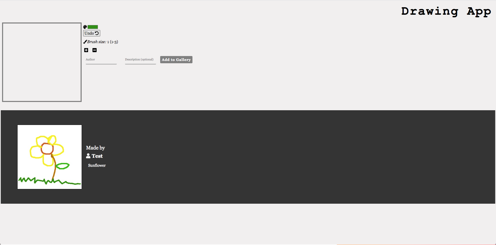

## Drawing App

Link to App demo(https://drawingapp.vercel.app/)
This is the frontend for the Drawing App. 

The backend can be found at https://github.com/victorP0/DrawingApp_api.

## API Documentation

The App uses the canvas API (https://developer.mozilla.org/en-US/docs/Web/API/Canvas_API). 

## Screenshots

## Description

This a drawing app that allows Users to draw and save their drawings to the gallery. The gallery will display drawings added to the gallery in the last 7 days.

## Technologies used

Javascript, HTML css, express, mocha, chai, pSQL
